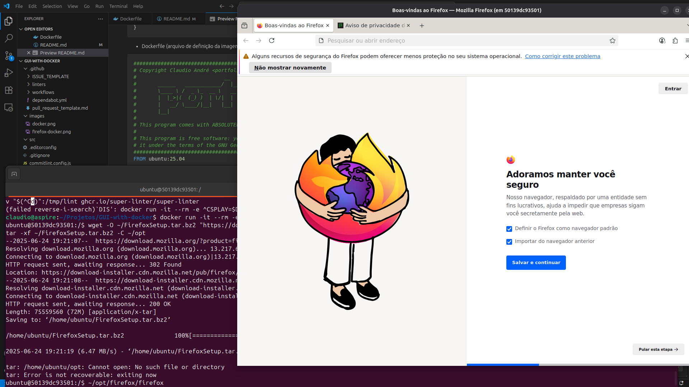

<!-- markdownlint-disable MD030 -->
<!-- markdownlint-disable MD046 -->

# GUI e Docker: Usando Docker em Aplicativos com Interface Gráfica

Neste artigo iremos comprovar que é possível usar o Docker para empacotar e executar aplicativos gráficos.

## O que é e para que serve o Docker?

[Docker](https://www.docker.com/) é uma plataforma que simplifica o processo de gerenciamento, execução e distribuição
de aplicativos. O Docker permite que se criem ambientes independentes e isolados para instalar e executar aplicativos.
Esses ambientes são chamados de contêineres.

A tecnologia Docker usa o kernel do Linux e funcionalidades de kernel, como cgroups e namespaces, para segregar
processos.

Com o Docker não há mais problemas de compilação ou dependência em distintos ambientes, o infame _DLL hell_ [1]. Isso
permite que o time de TI execute um contêiner em diferentes máquinas sem esforço.

**Imagem 1: Máquinas Virtuais versus Contêineres**

 \
_Fonte_: RedHat.

Portanto, uma imagem [Docker](https://www.docker.com/) é um template somente leitura usado para executar código em um
contêiner do Docker. Uma imagem Docker é um arquivo imutável que contém os binários, os arquivos de configuração, as
bibliotecas, as dependências, as ferramentas e outros arquivos necessários para a execução de um aplicativo.

Vantagens do Docker:

- é rápido;
- é multiplataforma;
- mantém seu espaço de trabalho limpo;
- mais simples e rápido que lidar com máquinas virtuais;
- se funcionou na máquina do desenvolvedor, irá funcionar em produção [2].

[1] Inferno de DLLs (do inglês DLL hell) é uma designação dada a complicações ao lidar com dynamic-link libraries
(DLLs).\
[2] O Docker, como qualquer tecnologia, não é à prova de tudo.

### Por que este assunto é relevante? Quais os benefícios desta abordagem?

O Docker oferece muitas vantagens para a equipe de TI:

- a tecnologia é leve e rápida: os aplicativos (podem) inicializar e se encerrar em segundos;
- uma vez que você configura o ambiente, pode usar outros computadores para executar o aplicativo;
- alta portabilidade, simplicidade para transferir o aplicativo para outras máquinas;
- encapsulamento (seu projeto é uma unidade auto contida);
- em oposição às pesadas máquinas virtuais, com contêineres Docker a implantação leva alguns segundos.

### Mas nem tudo são flores

Por outro lado, o daemon (o serviço) do Docker também pode representar uma vulnerabilidade para a segurança. Para
executar contêineres Docker o daemon requer privilégios de `root`. Portanto, este é um ponto que requer um cuidado maior
ao definir as pessoas com acesso e o local onde o serviço residirá.

Ainda, uma vez que a imagem Docker deve conter todas as dependências necessárias à execução do aplicativo:

- imagens Docker irão duplicar bibliotecas dinâmicas (DLLs);
- imagens Docker são maiores que a alternativa de usar apenas uma cópia destas bibliotecas;
- imagens Docker não são automagicamente atualizadas quando novas versões e correções de segurança destas bibliotecas
  são lançadas.

## O que é e para que serve a GUI?

Uma interface gráfica do usuário (GUI) é um sistema de componentes visuais interativos de software de computador que
permite que os usuários se comuniquem com um computador por meio de símbolos, metáforas visuais e dispositivos de
apontar. Ela permite que os usuários interajam com dispositivos eletrônicos por meio destes elementos gráficos e
visuais, facilitando a execução de tarefas e sem a necessidade de memorizar comandos complexos.

## Um Estudo de Caso

Para começar nosso experimento iremos testar o uso de um aplicativo gráfico de propósito geral. Uma vez que tenhamos
sucesso em empacotar um aplicativo GUI compilado para Linux dentro de um contêiner, iremos testar, com auxílio do
[projeto Wine](https://www.winehq.org/) [1], o uso de um aplicativo GUI Windows dentro de uma imagem Docker.

Ao final, iremos comprovar que o Docker é capaz de executar aplicativos gráficos (GUI) de forma encapsulada e portável.

[1] O Wine é uma camada de tradução (um lançador de programas) capaz de executar aplicações Windows em Linux e em outros
sistemas operacionais compatíveis com POSIX.

### O experimento

Utilizamos em nosso experimento o seguinte código fonte:

- Dockerfile (arquivo de definição da imagem Docker):

```Dockerfile
########################################################################
# Copyright Claudio André <portfolio-2025br at claudioandre.slmail.me>
#                             __    _____      .__  .__
#       ______   ____________/  |__/ ____\____ |  | |__| ____
#       \____ \ /  _ \_  __ \   __\   __\/  _ \|  | |  |/  _ \
#       |  |_>|(  (_) )  | \/|  |  |  | (  (_) )  |_|  (  (_) )
#       |   __/ \____/|__|   |__|  |__|  \____/|____/__|\____/
#       |__|
#
# This program comes with ABSOLUTELY NO WARRANTY; express or implied.
#
# This program is free software: you can redistribute it and/or modify
# it under the terms of the GNU General Public License 2.0
########################################################################
# More info at https://github.com/portfolio-2025br/docker-for-gui

FROM ubuntu:25.04

ENV DEBIAN_FRONTEND=noninteractive

SHELL ["/bin/bash", "-o", "pipefail", "-c"]

# Prepare the environment
RUN apt-get update -y \
    && apt-get install -y --no-install-recommends \
        ca-certificates=* \
        language-pack-en=* \
        locales=* \
        software-properties-common=* \
        wget=* \
        xz-utils=*

# Install Wine
RUN dpkg --add-architecture i386 \
    && mkdir -p /etc/apt/keyrings \
    && chmod 0755 /etc/apt/keyrings \
    && wget -q -O - https://dl.winehq.org/wine-builds/winehq.key | gpg --dearmor -o /etc/apt/keyrings/winehq-archive.key - \
    && wget -nc -P /etc/apt/sources.list.d/ "https://dl.winehq.org/wine-builds/ubuntu/dists/$(lsb_release -sc)/winehq-$(lsb_release -sc).sources" \
    && apt-get update -y \
    && apt-get install -y --install-recommends winehq-stable=*

# Install MESA
RUN apt-get install -y --no-install-recommends libgl1-mesa-dri=*

# Clean up
RUN rm -rf /var/lib/apt/lists/* /var/cache/apt/archives/*

# ==================================================================
# Setup
# ------------------------------------------------------------------
ARG GID=1000
ARG UID=1000
ARG USERNAME=portfolio
RUN groupadd -g ${GID} -o "${USERNAME}" \
    && useradd -m -u ${UID} -g ${GID} -o -s /bin/bash -l "${USERNAME}"
USER $USERNAME

ENV LANG=en_US.UTF-8
ENV LC_ALL=en_US.UTF-8
ENV DISPLAY=:0

HEALTHCHECK NONE
```

### Explicação e comandos usados

Uma vez que você tenha Docker instalado, configurado e funcionando:

1.  Use o comando `xhost` para adicionar e excluir nomes de usuário da lista com permissão para fazer conexões com o
    servidor X;

    ```sh
    # Permitir que o local user docker possa acessar o X Server
    xhost +local:docker
    ```

    A saída irá confirmar que os clientes locais (como contêineres do Docker) em execução no meu sistema agora têm
    permissão para se conectar ao meu servidor X

2.  Execute o contêiner:

    ```sh
    # Para dar build na imagem, no diretório que contém o arquivo Dockerfile:
    # $ docker build -t gui-docker .
    docker run -it --rm -e DISPLAY=$DISPLAY -v /tmp/.X11-unix:/tmp/.X11-unix gui-docker bash
    ```

    ```sh
    # Dentro do contêiner obter o Firefox
    wget -O ~/FirefoxSetup.tar.bz2 "https://download.mozilla.org/?product=firefox-latest&os=linux64&lang=pt-BR"
    mkdir -p ~/opt
    tar -xf ~/FirefoxSetup.tar.bz2 -C ~/opt

    # Executar o firefox dentro do contêiner
    ~/opt/firefox/firefox
    ```

    Sucesso ([ver Apêndice 1](#1-firefox-para-linux-executando-dentro-do-docker))! O Firefox existe apenas dentro do
    contêiner e foi executado com sucesso.

3.  Para concluir, remover a permissão de acesso ao X:

    ```sh
    # Remover a permissão de acesso do Docker ao X Server
    xhost -local:docker
    ```

Obstáculo superado, agora vamos testar a instalação de um aplicativo Windows dentro do contêiner Docker.

Da mesma forma que fizemos acima, você precisa dar permissão ao usuário docker para acessar o X e executar a imagem
Docker com os parâmetros mínimos requeridos. Então:

1.  De dentro do contêiner, obter e instalar o IRPF 2025:

    ```sh
    # Dentro do contêiner obter o executável
    wget https://downloadirpf.receita.fazenda.gov.br/irpf/2025/irpf/arquivos/IRPF2025Win32v1.4.exe

    # Executar o instalador do IRPF 2025 dentro do contêiner
    wine IRPF2025Win32v1.4.exe
    ```

Novamente sucesso ([ver Apêndice 2](#2-programa-irpf-para-windows-executando-dentro-do-docker))! O aplicativo executou
normalmente como se estivéssemos rodando no sistema operacional `host`. O aplicativo foi instalado dentro do contêiner e
foi executado com sucesso.

### Os Resultados

De fato, não encontramos obstáculos para usar o Firefox instalado dentro de uma imagem Docker
([ver Apêndice 1](#1-firefox-para-linux-executando-dentro-do-docker)). Basta instalar e usar.

Ainda, instalar o IRPF para Windows da Receita Federal dentro do Docker com Wine transcorreu sem problemas
([ver Apêndice 2](#2-programa-irpf-para-windows-executando-dentro-do-docker)).

E, como bônus, lembre-se que meu `host`, a minha máquina de trabalho real está limpa. Fiquei horas desenvolvendo e
testando para concluir este projeto e nenhum arquivo ou DLL ficará perdido na minha máquina assim que eu remover as
imagens e contêineres Docker envolvidos.

As versões de software usadas neste artigo foram:

```sh
$ docker --version
Docker version 28.2.2, build e6534b4

$ cat /etc/*release | grep DISTR
DISTRIB_ID=Ubuntu
DISTRIB_RELEASE=25.04
DISTRIB_CODENAME=plucky
DISTRIB_DESCRIPTION="Ubuntu 25.04"

# Dentro do contêiner
$ wine --version
wine-10.0
```

## Próximos Passos

Embora a abordagem mais adequada para aplicatovos .NET gráficos que precisam ser multi-plataforma seja a migração para
.NET (core) usando alguma biblioteca gráfica como QT ou GTK, acreditamos que seja proveitoso estudar quais os desafios
que um projeto WPF, por exemplo, precisaria superar para que pudesse ser executado dentro de um contêiner Docker com
Wine.

Portanto, criar um PoC .NET gráfico para Windows e testar os desafios da migração para Docker com Wine é sugerido como
um objetivo futuro.

## Apêndice

### [1] Firefox para Linux executando dentro do Docker



Firefox compilado para Linux obtido em <https://download.mozilla.org/>.

---

### [2] Programa IRPF para Windows executando dentro do Docker


IRPF para Windows obtido em <https://downloadirpf.receita.fazenda.gov.br/irpf/2025/irpf/arquivos/IRPF2025Win32v1.4.exe>.

---

### [3] Configuração do Wine


O comando `winecfg` foi executado para configurar o ambiente, mas nenhum pacote extra (como o `mono`) ou configuração
diferente do padrão foi usado ou instalado.
